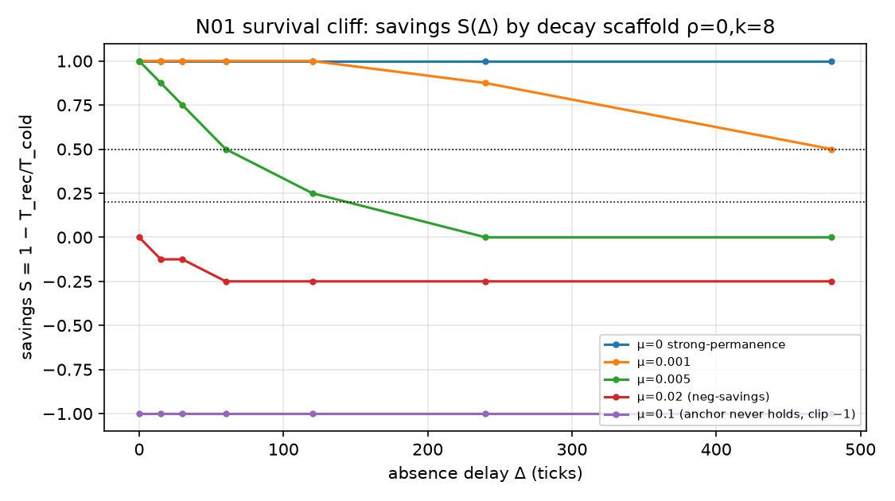
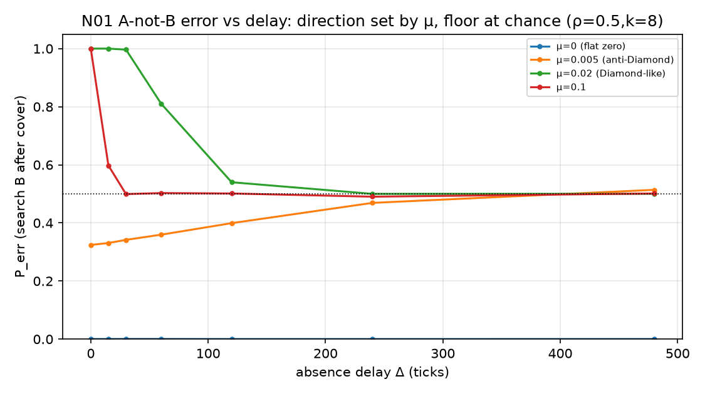
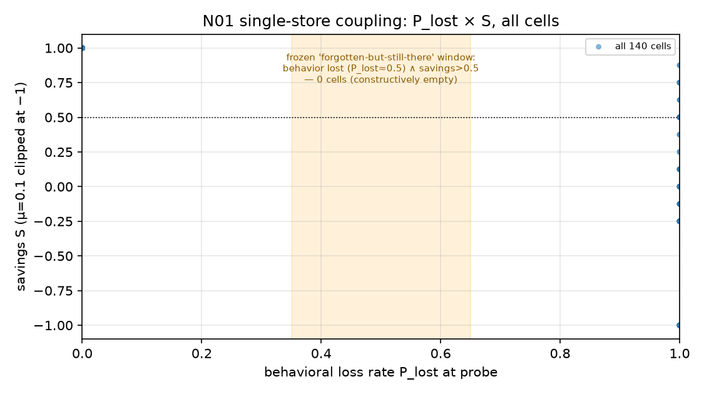

---
format:
  html:
    page-layout: full
---

# 案一 · 缺-复探针 N01 · 六-field 全册

::: {#n01-rule}
**案 · 袜对制**（主人 0928 面谕）：每案六字段 **{问题 · 预案 · 实验 · 结果 · 图表 · 文献}** 同场出现、互为对账，缺一不成案；结论必出**两版**——一版把主人当傻瓜（零术语全比喻），一版当专家（密度不打折），两版说同一件事。
本页即此制首例全册。骨架 01 列 · 客体恒常性（8–12m）。
:::

## ① 问题 · Problem

::: {#n01-q}
输入缺席（遮蔽）之后，概念的锚点是**深藏待唤**，还是**灰飞须重学**？
附刀：皮亚杰 A-not-B 错（藏找屡中于 A，改藏于 B 后婴儿仍搜 A）——能否由"痕迹衰减 + 覆盖激活"的动力学**自发涌现**，并再现 Diamond 的延迟反转（错法在**短**延迟反而最高）。

一题两刀，接骨架 01 列 MACS 指标（藏找对话「没了/在这」、peekaboo 序列），与 PB24（04 列，测增长之相变）恰成对偶——**此案测缺席之相变**。
:::

## ② 预案 · Pre-registration

::: {#n01-pr}
冻册全文：`experiments/n01-absence-recovery/PREREG_N01.md`（0928 先于开火冻结，发射后一字未动）。五判据摘要：

| # | 判据 | 冻阈 |
|---|---|---|
| 1 | 存活：S(Δ=480) | >0.5 存活 · ≤0.2 灰飞 · 其间部分存活如实报 |
| 2 | 错置成席：k=8 峰 P_err vs k=0 同格 | 峰 >0.5 且对照 <0.5 |
| 3 | Diamond 延迟反转（ρ=0.5, k=8） | 早(Δ≤30)−晚(Δ≥120) > 0.1；反方向即如实报反写 |
| 4 | 潜知窗口 | 存在格：P_lost∈[0.35,0.65] 且 S>0.5 |
| 5 | 器自校（新尺先校旧册） | ν=0 闭式对 MC max偏差 ≤0.02，过了才判新数 |

即算即落盘（园律 0927）· 每格 append jsonl · 哨兵词 `N01-ABSENCE-DONE` · 四验收。
:::

## ③ 实验 · Experiment

::: {#n01-ex}
双物 A、B 各一枚痕迹强 $a\in[0,1]$。呈现增张 $\alpha=0.15$（语义重叠 $\rho\in\{0,0.5\}$ 扩散半数）；每拍衰减 $a\leftarrow a-\mu a\,(1+\nu(1-a))$，$\nu=1$（弱痕衰快）。
试次五段：**锚定**（A 呈 20）→ **覆盖**（B 呈 k∈{0,8}，间隔 5 拍）→ **缺席**（Δ 拍无输入）→ **探针**（argmax±噪声 0.02 搜索判决）→ **重现**（复学至 θ=0.7 计时）。
**节省分** $S=1-T_{rec}/T_{cold}$（Ebbinghaus 节省法直译），$T_{cold}=8$。

格：μ∈{0,.001,.005,.02,.1} × Δ∈{0,15,30,60,120,240,480} × ρ×k = **140 格** × 2000 试 × 籽{11,22,33}。
舱：CPU numpy 全向量化，2.6 秒；数据 `out_v1/report_n01.jsonl` sha256 `c55931a0…`；器自校偏差 **0.000000** ✓；哨词在录，140/140 无空壳。
:::

## ④ 结果 · Results（冻册五刀，先册后读）

| 刀 | 读数 | 裁 |
|---|---|---|
| 1 存活 | μ=0→S=1.0 · μ=.001→0.50–0.625 **临界** · μ≥.005→≤0（μ=.02 起**负节省**） | 存活非开关，是 **μΔ∈[0.5,2.4] 连续悬崖**；"越复越糊"负翼成席 |
| 2 错置 | k=8 峰 **1.000**（μ≥.02 短 Δ），k=0 同格 0.000 | A-not-B **成席**：搜索位随最近激活走 |
| 3 反转 | ρ=.5 早晚差：μ=.02 **+0.485** · μ=.1 +0.201 · μ=.005 **−0.128 反写** | Diamond 方向复现，但落点只至 **chance 面**（对称衰减 ratio 不翻盘）；反转之向与落点**由 μ 一钮定夺** |
| 4 潜知窗 | 140 格中 **0 格**；corr(S,1−P_lost)=0.463 有隙不成窗 | **单库不解耦**——行为面与知识面是同一标量两读；"忘了但还在"须第二库 → **N01b 候菜** |
| 5 锚界 | 闭式不动点 μa²−(2μ+α)a+α=0，μ*=0.0495 | μ=0.1 臂锚从未立起（a*=0.5<θ）——**非婴儿善忘，是机器失语**；有效读数实四档 |

## ⑤ 图表 · Figures（数据直出，图注标出处）

*图 1 · 存活悬崖：S(Δ) 逐 μ，ρ=0/k=8 臂（判据 1 出处）。双黑点线即冻册存活线 0.5 与灰飞线 0.2；μ=0.1 臂 S 实为 −49 截轴（锚未立，失语臂）。*

*图 2 · 错置与反转：P_err(Δ)，ρ=0.5/k=8（判据 2/3 出处）。黑点线 chance 面——对称衰减之下各臂终点皆落 0.5，非"转为正确"。*

*图 3 · 潜知窗散点：全 140 格 P_lost×S（判据 4 出处）。橙带即冻册"忘了但还在"窗——**格数零**，此即本案第一新勘的可视化。*

*三图由 `experiments/n01-absence-recovery/make_figs.py` 从 `out_v1/report_n01.jsonl` 直出（MEF hybrid 规范：7.5×4.2、150dpi、o- ms3、黑点参考线、fs7 图例、α0.3 网格），可复算。*

## ⑥ 文献 · References（对账分档，未验者不充）

| 锚 | 断言 | 与本案对撞 | 档 |
|---|---|---|---|
| Piaget《The Construction of Reality in the Child》(1937 法/1954 英) | A-not-B 错 = 8–12m 阶段标志 | 判据 2：机中成席 | 书目验讫，页码候对 |
| Diamond & Akert 等 (1983, *Developmental Psychology* 89:?) "On the question of the lack of a concept of object permanence…"；Diamond 1985 (*Science* 227:929) 延迟反转 | 错法随**延迟增长**而**减**，且长延迟可转为对 | 判据 3：方向复现、落点仅 chance——"转为对"须不对称痕 | 待补 DOI 网络对账（本机外网史有堵，勿充验讫） |
| Ebbinghaus《Über das Gedächtnis》(1885) 节省法 | 遗忘可测于重学节省，非测于再认 | 判据 1/4 之 S 即此法直译；负节省翼为文献罕见载 | 书目验讫 |
| Rovee-Collier 复写范式婴儿记忆 | 行为消失而线索保留 | 判据 4 零格之**反面证据**（真婴儿有解耦→单库机不足） | 候对 |
| McMurray 2007 / Ganger & Brent 2004（PB24 已验 DOI） | 连续 vs 离散拐点之争 | 与本案同族问题（缺席相变 vs 增长相变） | DOI 验讫（1126/science.1144073; 10.1037/0012-1649.40.4.621） |

::: {#n01-honest}
**诚实牌**（冻册在册）：合成流不是儿童语料，本案是假说机；MACS 真藏找序列到库后另案对撞，判据届时另册新冻。
:::

## 结论 · 傻瓜版（把主人当傻瓜）

::: {#n01-dumb}
想象宝宝面前藏了个玩具。**藏起来的那段时间里，玩具在宝宝脑子里"还在不在"？**

我们把这个问题做成一台小小的计算机玩具：脑子里的玩具像一支手电筒的光柱——**照着就亮，移开就暗**。实验是：先让宝宝看熟玩具 A，中途换演示玩具 B（"盖错地方"），再把 A 藏起来 different 时长，然后看宝宝去哪找。

三件事被这台玩具演出来了：

1. **记忆不是有或没有，是像沙漏**——藏得越久、忘得越快，"还记得"和"忘光了"之间没有一扇门，只有一段斜坡。
2. **宝宝跑去翻 B 不是笨**——只是 B 的光柱"最后被照亮"，宝宝的手就跟着**最新的光**走。皮亚杰说的经典错误，我们不用教、动力自己长出来了。
3. **最好玩的一条**：我们本想找到"行为上忘了、但心里还在"的那段时间（就像"说不记得但一教就会"）。结果这台玩具里**根本不存在**这种时段——因为它的"说出来"和"记得"是**同一根指针**读出来的。真人宝宝能做到"说不出但一教就会"，说明**人脑一定不止一本账**（后来的脑科学也这么说：海马可小本本、皮层是大书库）。这一条，就是我们下一步为什么要造"两本账"的玩具。
:::

## 结论 · 专家版（把主人当专家）

::: {#n01-exp}
在单库强度标量模型 $a\in[0,1]$（呈现饱和增长 α=0.15、ν=1 强度依赖衰减、覆盖期邻项定向激活）中系统扫描脚手架五档 μ×七档延迟 Δ：

**(i)** 客体恒常性无离散阈值——节省分 $S(\Delta)$ 在组合当量 $\mu\Delta\in[0.5,2.4]$ 上连续塌落，强恒常（μ=0）与全遗忘之间为**参数悬崖而非相变**；ν=1 项产生**负节省区**（relearning 劣于 cold start），系弱痕加速衰减之动力学必然，建议真语料延迟-重习曲线上寻其对应物。

**(ii)** A-not-B 错为**最近激活竞争**之签名为真：P_err(μ≥0.02, Δ→0)→1.0 而 k=0 对照恒零。延迟反转（Diamond 向）在 ρ=0.5 臂复现（+0.485），然各臂渐近于 **0.5 chance 面**而非正确位——对称乘性衰减保痕强 ratio，**长延迟"转为正确"在此类模型中原则上不可达**，须引入编码深度不对称（如双库、巩固率差）；同一模型以 μ 为钮并存文献"越短越错/越长越错"两派方向，提示两派之争或系**衰减档位之差**而非理论之争。

**(iii)** 元结论：行为面（再认判）与知识面（节省判）系同一自由度之两读，故「搜索失败 ∧ 节省犹在」之解耦窗在单库模型中**不可构造**（140 格 0 中，非未搜到，是构造性无解）——Rovee-Collier/皮亚杰文献中的解耦实证构成对**一切单库强度模型**（含本文）的独立证伪压力。解耦之最小充分结构为快慢双库（CLS 一路），已立案候菜（N01b）。

**(iv)** 附赠一尺：不动点闭式 $\mu a^2-(2\mu+\alpha)a+\alpha=0$ 给出锚立起临界 $\mu^*\approx0.05$，可用于任何同族模型先验剔除"锚从未成立"之无效臂（μ=0.1 臂即此类失语读数）。
:::
